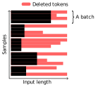

This blogpost concerns anyone who (1) is dealing with variable-length data samples, and (2) is looking to optimize their transformer-based code.

---

[FlashAttention](https://github.com/Dao-AILab/flash-attention) has changed the transformer game for some two years[^flash].
Compared to naive self-attention implementations, it boasts [staggering speed gains](https://github.com/Dao-AILab/flash-attention/blob/main/assets/flash3_fp16_fwd.png) in forward passes -- depending on the input sequence lengths.
In addition, it can reduce the [VRAM footprint](https://github.com/Dao-AILab/flash-attention/blob/main/assets/flashattn_memory.jpg) of self-attention by literal orders of magnitude as it reduces the $\mathcal{O}(n^2)$ self-attention memory footprint to $\mathcal{O}(n)$.
Besides allowing bigger input sequence lengths, lower memory footprints allows people to train larger models with larger batch sizes using the same compute budget.
As FlashAttention just represents an optimized kernel, it does all this without any of the significant drawbacks that attention approximations exhibit.

As it's since been integrated into the main PyTorch library, it's usage is quickly becoming the standard MO for self-attention computation.


## Underperformance of `flash_attn_varlen_func` vs "vanilla" FlashAttention

If you have variable-length sequence data, the usual thing to do is to provide a $N \times L$ boolean mask, indicating where the padding tokens are.
This mask will restrict self-attention to not let padded tokens participate.
As it currently stands, FlashAttention does not support such masks.
Rather, it provides separate implementations for "vanilla" self-attention and "variable-length" self-attention.
(If you use the main PyTorch self-attention implementation and provide a mask to account for variable lengths, PyTorch will use a slower non-FlashAttention implementation instead).

The problem is that FlashAttention's variable-length operation simply does not deliver the same throughputs as the default operation for smaller-to-moderate sequence lengths:

<div style="text-align: center;">

</div>

Benchmark details can be found in the footnotes[^benchmark].

In order to circumvent the usage of FlashAttention's varlen operation, I propose to hack the data in a way such that - per batch - it is not variable-length anymore.

## Cutting to min size in each batch

Consider a dataset cut into batches.
The simplest way in order to hack the data to fixed-length per batch is to cut off the ends of the data per batch to the smallest size:

<div style="text-align: center;">

</div>

In PyTorch, one can achieve this by (1) wrapping a Dataset object to eliminate any padding to the original sequence length size, and (2) writing a custom batch collate function that aggregates all the samples in a batch and cuts to the minimal sequence length.
A simple implementation could look something like this:
```python
from torch.utils.data import *
import torch

class Cut2MinDatasetWrapper(Dataset):
    def __init__(self, dataset, seqlens):
        super().__init__()
        self.dataset = dataset
        self.seqlens = seqlens

    def __getitem__(self, index):
        sample = self.dataset[index]
        seqlen = self.seqlens[index]
        return sample[..., :seqlen] # eliminates padding

    def __len__(self):
        return len(self.dataset)
    
    def collate_fn(self, batch):
        return default_collate(self._cut_to_uniform_size(batch))

    @staticmethod
    def _cut_to_uniform_size(list_of_objects):
        min_len = min([b.shape[-1] for b in list_of_objects])
        return [b[..., :min_len] for b in list_of_objects]
```

For an example usage, consider a dummy dataset of 10000 variable-length tensors (ranging from 5 to 100 in length):
```python
dataset = []
for _ in range(10000):
    dataset.append(torch.randn(torch.randint(size=(), low=5, high=1000),))

seqlens = torch.tensor([len(sample) for sample in dataset])
dataset = torch.nn.utils.rnn.pad_sequence(dataset, batch_first=True)
```

Usage of this dataset object would look like this:
```python
dataset = Cut2MinDatasetWrapper(dataset, seqlens)
dataloader = DataLoader(
    dataset,
    batch_size=8,
    shuffle=True,
    collate_fn=dataset.collate_fn
)
next(iter(dataloader))
```

## Minimizing data loss by bucket batching

It's easy to see that we will merit somewhat by making sure similar sizes are batched together.
This is where bucket sampling, a concept which has been around for quite some time, comes in.
For some reason, it was impossible for me to find a modern implementation (that includes support for - for example - distributed data parallel), so here I will provide a simple implementation:

```python
def _partitions_to_len(n_samples, n_partitions, batch_size):
        # Count the number of samples per partition
        samples_per_partition = [
            math.ceil(n_samples / n_partitions)
        ] * n_partitions

        # The last partition may have fewer samples
        samples_per_partition[-1] -= (n_samples // n_partitions) % n_partitions

        # Count the number of batches per partition and sum
        len_ = sum([math.ceil(samples / batch_size) for samples in samples_per_partition])
        return len_

class BucketBatchSampler(BatchSampler):
    def __init__(
        self,
        dataset,
        seqlens, # torch.Tensor (n, )
        batch_size,
        n_partitions=100,
        indices=None, # None or list
        drop_last=False,
    ):
        super().__init__(dataset, batch_size, drop_last)

        # `indices` subsamples the dataset in the case of a Distributed Data setting
        if indices is not None:
            len_dataset = len(indices)
            self.seqlens = seqlens[indices]
            indices = torch.tensor(indices)
        else:
            len_dataset = len(dataset)
            self.seqlens = seqlens
            indices = torch.arange(len_dataset)

        # randomly partition dataset in n_partitions
        self.partitioner = BatchSampler(
            RandomSampler(indices),
            math.ceil(len_dataset / n_partitions),
            False
        )
        self.indices = indices

        self._len = _partitions_to_len(len_dataset, n_partitions, batch_size)

    def __iter__(self):
        # For every partition, order all indices in it by seq. len
        indices_per_partition_ordered = []
        for partition in self.partitioner:
            partition_indices = self.indices[partition]

            partition_asort_seqlens = torch.argsort(self.seqlens[partition], descending=True)
            partition_indices_in_order = list(partition_indices[partition_asort_seqlens.numpy()])
            indices_per_partition_ordered.append(partition_indices_in_order)

        # Then iterate through all partitions
        for partition_indices in indices_per_partition_ordered:
            # Make batches per partition, then randomly shuffle around
            # The shuffling prevents that the smallest batches will always be first
            for batch in SubsetRandomSampler(list(BatchSampler(partition_indices, self.batch_size, self.drop_last))):
                yield batch

    def __len__(self):
        return self._len
```

The following schematic should make it clear what is happening:

<div style="text-align: center;">

</div>

Note that this implementation includes many steps in order to retain as much "stochasticity" as possible in batch construction.
Partitioning the data in subsets before sorting makes it so that samples do not consistently land in the same batch each epoch.
Shuffling batches after bucketing makes sure that the model is not consistently presented with batches of similar sizes right after one another.

The distributed data parallel version of bucket sampling follows the same procedure - but separately for each slice of data each device processes in an epoch. Implementation in the footnotes[^distributed].

An example using the same data as previous:
```python
sampler = BucketBatchSampler(
    dataset,
    seqlens,
    batch_size=8,
    n_partitions=20,
    )

dataloader = DataLoader(
    dataset,
    batch_sampler=sampler,
    collate_fn=dataset.collate_fn
)
next(iter(dataloader))
```

Using the previous dummy example and **without bucket batching,** the proportion of tokens thrown away due to cutting to min size in a batch is **$\pm$ 77%**.
**With bucket batching as above, this figure becomes $\pm$ 1.39%**.

Note that the number of made partitions has an impact on this figure.
Increasing the partition number makes mini-batch construction more random, but each subset is smaller.
The smaller size of each subset makes it so that it is harder to create batches wherein all samples have similar sequence lengths.
Hence, it is crucial to balance the number of partitions with training dataset size.

Many problem settings allow the remaining data-token loss to be made as inconsequential as possible.
For example, with many data modalities, one can meaningfully sort the tokens in a sample such that the least-important tokens are last in the input set.
Consider scRNA-seq, where one might only input non-zero counts into the model, such as in scGPT[^scGPT].
If one sorts gene inputs by its count value, only the very-lowly expressed genes are thrown away.
For mass spectral data, we can construct a similar rationale, throwing away the lowest intensity peaks in a spectrum.
For protein/RNA/DNA/SMILES sequences, I see two choices: either (1) similarly cutting off the ends, or (2) taking a random crop.

Using this framework, every batch has the same number of tokens, relinquishing the need for masking tokens.
Hence, it is possible to use "vanilla" FlashAttention operation again.

## A PyPI package

If you want to use the concepts I've laid out here for yourself, I have deposited a more fleshed-out version of the code on [GitHub](https://github.com/gdewael/cut2min-bucket).
Additionally, the code is distributed on PyPI as a (hopefully) easy to use package:

```bash
pip install cut2min-bucket
```


[^flash]: Dao, Tri, et al. "Flashattention: Fast and memory-efficient exact attention with io-awareness." Advances in Neural Information Processing Systems 35 (2022): 16344-16359.

[^scGPT]: Cui, Haotian, et al. "scGPT: toward building a foundation model for single-cell multi-omics using generative AI." Nature Methods (2024): 1-11.

[^benchmark]:
    To reproduce the `flash_attn_varlen_func` forward speed benchmark, using `torch 2.4.0` and `flash-attn 2.6.3`, run in an IPython Notebook:

    ```python
    SEQLEN = 512
    import torch
    import torch.nn.functional as F
    from flash_attn import flash_attn_func, flash_attn_varlen_func

    def modified_forward_default(q,k,v, mask=None, causal=False):
        return flash_attn_func(q,k,v)

    def modified_forward_varlen(q,k,v, mask=None, causal=False):
        bsz, seqlen, nh, h = q.shape
        q = q.view(-1, nh, h)
        k = k.view(-1, nh, h)
        v = v.view(-1, nh, h)
        seqlens = torch.arange(bsz+1) * seqlen
        seqlens_pert = seqlens + F.pad(torch.tensor([-1, 1]).repeat(bsz//2).cumsum(0), (1,0))
        # we periodically assign 1 tokens more or less from and to each sequence
        # this makes `flash_attn_varlen_func` handle the input as variable length
        # otherwise, it shortcuts to default flash attention
        cu_seqlens_q = cu_seqlens_k = seqlens_pert.to(q.device).to(torch.int32)
        max_seqlen_q = max_seqlen_k = seqlen+2
        return flash_attn_varlen_func(q,k,v, cu_seqlens_q, cu_seqlens_k, max_seqlen_q, max_seqlen_k).view(bsz, seqlen, nh, h)


    q = torch.randn(16, SEQLEN, 8, 32).to(torch.bfloat16).to("cuda:0")
    k = torch.randn(16, SEQLEN, 8, 32).to(torch.bfloat16).to("cuda:0")
    v = torch.randn(16, SEQLEN, 8, 32).to(torch.bfloat16).to("cuda:0")

    %timeit z = modified_forward_varlen(q,k,v)
    %timeit z = modified_forward_default(q,k,v)
    ```
    For various values of `SEQLEN`.

    Then, to compute TFLOPs/s, use the resulting time:
    ```python
    import math
    time_in_sec = ...

    def flops(batch, seqlen, headdim, nheads, causal, mode="fwd"):
        assert mode in ["fwd", "bwd", "fwd_bwd"]
        f = 4 * batch * seqlen**2 * nheads * headdim // (2 if causal else 1)
        return f if mode == "fwd" else (2.5 * f if mode == "bwd" else 3.5 * f)
    def efficiency(flop, time):
        return (flop / time / 10**12) if not math.isnan(time) else 0.0

    tflops_s = efficiency(flops(16, SEQLEN, 8, 32, False), time_in_sec)
    ```

    Note that `flash_attn_varlen_func` defaults to the the default `flash_attn_func` if given fixed-length sequences.
    For this reason, this benchmark periodically assign 1 tokens more or less from and to each sequence to force the usage of `flash_attn_varlen_func`.

[^distributed]:
    Implementation of distributed bucket batch sampler:
    ```python
    class DistributedBucketSampler(DistributedSampler):
        def __init__(
            self,
            dataset,
            batch_size,
            n_partitions = 100,
            num_replicas=None,
            rank=None,
            shuffle=True,
            seed=0,
            drop_last=False,
        ):
            super().__init__(
                dataset,
                num_replicas=num_replicas,
                rank=rank,
                shuffle=shuffle,
                seed=seed,
                drop_last=drop_last
            )

            self.batch_size = batch_size
            self.n_partitions = n_partitions

            self._len = _partitions_to_len(self.num_samples, n_partitions, batch_size)
        def __iter__(self):
            # Inherit a list of indices from parent class DistributedSampler
            indices = list(super().__iter__())

            # Use it to create a bucketbatchSampler
            batch_sampler = BucketBatchSampler(
                self.dataset,
                batch_size=self.batch_size,
                n_partitions=self.n_partitions,
                indices = indices
                )
            return iter(batch_sampler)

        def __len__(self):
            return self._len
    ```

    Note that if you're using PyTorch-Lightning, note that `Trainer` would automatically instate its own sampler if using the `ddp` strategy, hence overriding this self-defined sampler.
    To prevent this behavior, make sure to use `use_distributed_sampler=False` when calling `Trainer`.