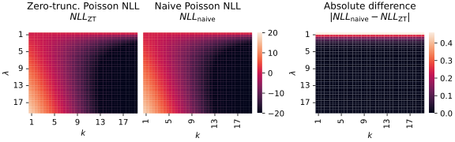

Recently, [I performed research on single-cell transcriptomic transformers](https://doi.org/10.1101/2025.04.02.646825).
When porting language model paradigms to this data modality, a pre-training task can be formulated that predicts gene expression levels from their partly masked versions.
The gene expression levels typically consist of discrete counts.
These are commonly assumed to follow either a (1) Poisson, (2) negative binomial, or (3) zero-inflated negative binomial distribution.

Using single-cell transformers on gene expression profiles poses challenges w.r.t. data dimensionality.
In essence, every expression profile contains +- 20 000 genes, each making up one input token.
This number of tokens will pose issues for research-institute-scale hardware, even when using memory efficient versions of self-attention.
Luckily, it is not unreasonable to assume that all the relevant expression information is contained within the non-zero counts in the profile[^implicit].
By removing all zero counts from the expression profiles, the usual distributional assumptions do not hold anymore.
Instead, all prior distributions become [zero-truncated](https://en.wikipedia.org/wiki/Zero-truncated_Poisson_distribution).
This blogpost describes the Zero-truncated versions of the Poisson and Negative binomial distributions.

## The zero-truncated Poisson distribution

The Poisson distribution is given by:

$$
f_\text{Pois}(k;\lambda) = \mathrm{Pr}(X=k) = \frac{\lambda^ke^{-\lambda}}{k!}
$$

characterizing the probability of observing a (true) count $k$, given an (estimated) mean $\lambda$.
Its zero-truncated version is, then:

$$
\begin{align}
f_\text{ZT-Pois}(k;\lambda) &= \mathrm{Pr}(X=k|X>0) \\
&= \frac{f_\text{Pois}(k;\lambda)}{1-f_\text{Pois}(0;\lambda)}\\
&= \frac{\lambda^ke^{-\lambda}/k!}{1 - \lambda^0e^{-\lambda}/0!}\\
&= \frac{\lambda^ke^{-\lambda}}{(1-e^{-\lambda})k!}\\
&= \frac{\lambda^k}{(e^{\lambda} - 1)k!}\\
\end{align}
$$

The negative log-likelihood of the zero-truncated Poisson distribution is, hence:

$$
\begin{align}
\mathrm{NLL}_\text{ZT-Pois} &= -\log\left(\frac{\lambda^k}{(e^{\lambda} - 1)k!}\right) \\
&= -\log(\lambda^k) + \log(e^{\lambda} - 1) + \log(k!)\\
&= -k\log(\lambda) + \log(e^{\lambda} - 1) + \log(k!)\\
\end{align}
$$

When estimating $\lambda$ for an observed count $k$, the last term $\log(k!)$ can be ignored.
Further, for large estimated numbers of $\lambda$, $\log(e^{\lambda} - 1)$ becomes unstable.
As $\lim_{\lambda \to \inf}(\log(e^{\lambda} - 1)) = \lambda$, we can use this approximation for numerical stability during optimization.
Not so incidentally, replacing this term by the other essentially amounts to switching back to the NLL of the "default" Poisson distribution.
This makes sense, as at large values of $\lambda$, the two distributions are essentially equal (as the probability of obtaining a zero count with the default Poisson will approach zero).
The following heatmaps show the NLL values for differing values of true counts $k$ and predicted mean $\lambda$, both for the zero-truncated Poisson as well as the default Poisson.

 
One can see that substituting the second loss term $\log(e^{\lambda} - 1)$ for $\lambda$ when, say $\lambda > 10$ does not result in significant approximation errors.

## The zero-truncated negative binomial distribution

The negative binomial distribution is given by:

$$
f_\text{NB}(k;\mu,\theta) = \mathrm{Pr}(X=k) = \frac{\Gamma(k + \theta)}{k!\Gamma(\theta)}\left(\frac{\theta}{\theta+\mu}\right)^\theta \left(\frac{\mu}{\theta+\mu}\right)^k
$$

characterizing the probability of observing a (true) count $k$, given an (estimated) mean $\mu$ and overdispersion $\theta$.
Its zero-truncated version is, then:

$$
\begin{align}
f_\text{ZT-NB}(k;\mu,\theta) &= \mathrm{Pr}(X=k|X>0) \\
&= \frac{f_\text{NB}(k;\mu,\theta)}{1-f_\text{NB}(0;\mu,\theta)}\\
&= \frac{\frac{\Gamma(k + \theta)}{k!\Gamma(\theta)}\left(\frac{\theta}{\theta+\mu}\right)^\theta \left(\frac{\mu}{\theta+\mu}\right)^k}{1-\frac{\Gamma(0 + \theta)}{0!\Gamma(\theta)}\left(\frac{\theta}{\theta+\mu}\right)^\theta \left(\frac{\mu}{\theta+\mu}\right)^0}\\
&= \frac{\frac{\Gamma(k + \theta)}{k!\Gamma(\theta)}\left(\frac{\theta}{\theta+\mu}\right)^\theta \left(\frac{\mu}{\theta+\mu}\right)^k}{1-\left(\frac{\theta}{\theta+\mu}\right)^\theta }\\
&= \frac{\Gamma(k + \theta)}{k!\Gamma(\theta)} \frac{\left(\frac{\theta}{\theta+\mu}\right)^\theta}{1-\left(\frac{\theta}{\theta+\mu}\right)^\theta} \left(\frac{\mu}{\theta+\mu}\right)^k\\
&= \frac{\Gamma(k + \theta)}{k!\Gamma(\theta)} \frac{\theta^\theta}{\left(1-\frac{\theta^\theta}{(\theta+\mu)^\theta}\right)(\theta+\mu)^\theta} \left(\frac{\mu}{\theta+\mu}\right)^k\\
&= \frac{\Gamma(k + \theta)}{k!\Gamma(\theta)} \frac{\theta^\theta}{(\theta+\mu)^\theta - \theta^\theta} \left(\frac{\mu}{\theta+\mu}\right)^k\\
\end{align}
$$

The negative log-likelihood of the zero-truncated Negative Binomial distribution is, hence:

$$
\begin{alignat*}{2}
\mathrm{NLL}_\text{ZT-NB} &=&&-\log\left(\frac{\Gamma(k + \theta)}{k!\Gamma(\theta)} \frac{\theta^\theta}{(\theta+\mu)^\theta - \theta^\theta} \left(\frac{\mu}{\theta+\mu}\right)^k\\\right) \\
&=&&-\log(\Gamma(k+\theta)) + \log(k!)+ \log(\Gamma(\theta)) \\
& &&- \theta\log(\theta)+ \log((\theta+\mu)^\theta - \theta^\theta) \\
& &&- k\log(\mu)+ k\log(\theta+\mu) \\
\end{alignat*}
$$

Similarly, when estimating $\mu$ and $\theta$ for an observed count $k$, $\log(k!)$ can be ignored.
Further, if $\mu$ and $\theta$ are both large, the term $\log\left((\theta+\mu)^{\theta} - \theta^{\theta}\right)$ becomes numerically unstable.
Similarly to the Poisson distribution, we can exchange this term for $\theta \log(\theta+\mu)$ to obtain the NLL for the default negative binomial distribution.
The following heatmaps show the NLL values for differing values of predicted overdispersion $\theta$ and predicted means $\mu$.
The observed count $k$ is fixed at different levels (at each row in the plot).
The first column and second columns show NLL values for the zero-truncated NB and the "default" NB, respectively.

One can see that the "default" NB NLL becomes a good approximation of the zero-truncated NB NLL at high values of $\mu$ and (to a lesser extent) large values of $\theta$.
In our [preprint](https://doi.org/10.1101/2025.04.02.646825), we used the approximation when either $\mu+\theta > 15$ or $(\mu-1)(\theta-1) > 15$.

The code for using these as loss functions within PyTorch can be found [here](https://github.com/gdewael/bento-sc/blob/main/bento_sc/loss.py).

[^implicit]:
    Just like we do not need to explicitly mention to a transformer that some words were not present in a sentence, it might not be necessary to communicate to a transformer that some genes were inactive. The communication that this is the case can happen implicitly simply by this token not being present.