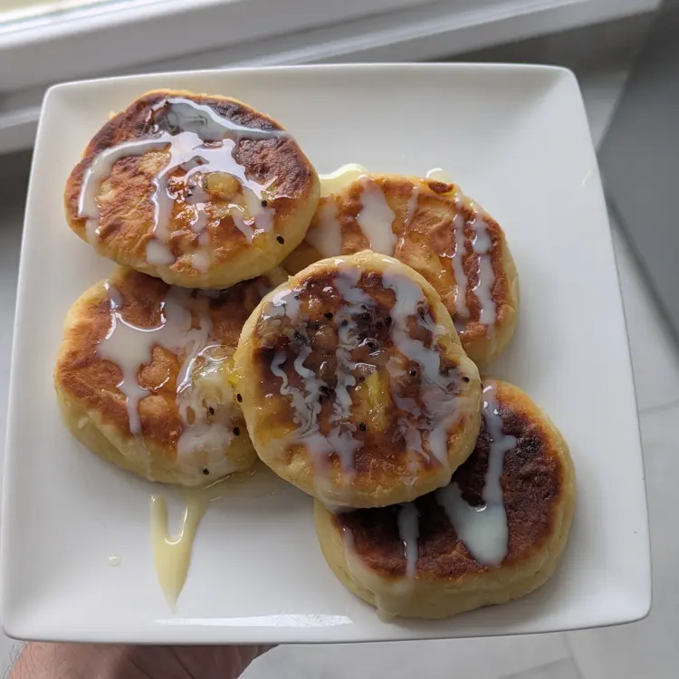
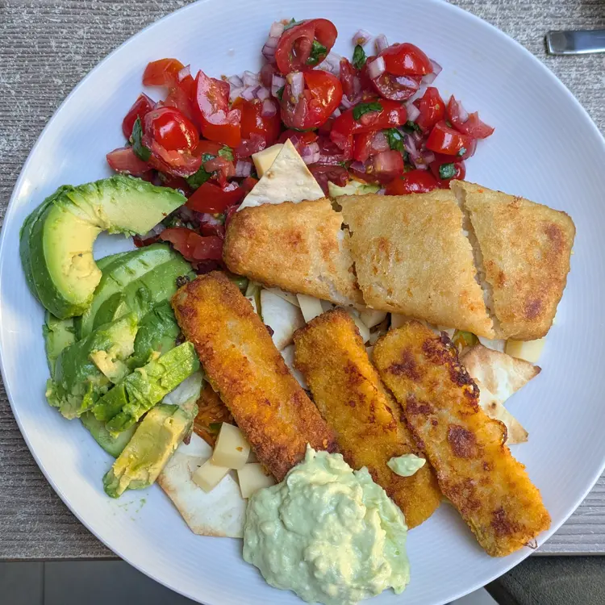
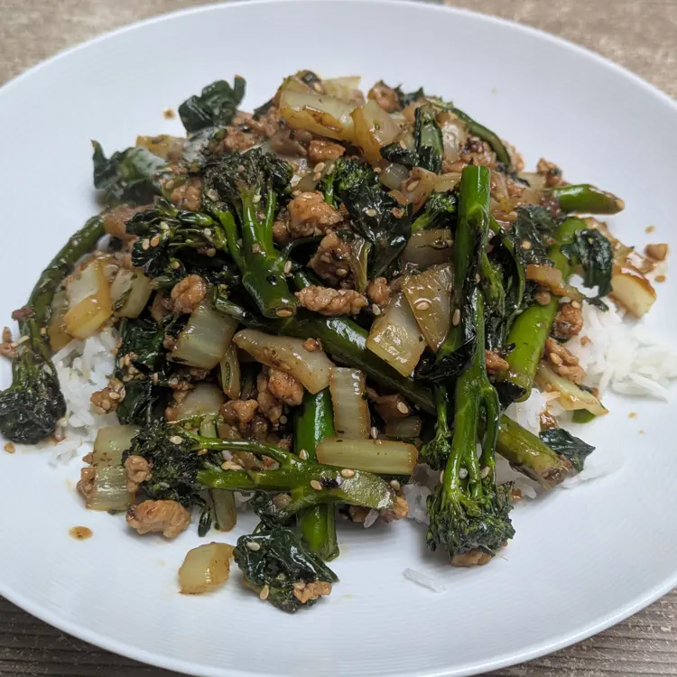

# Dish repository

I am bad at strictly following recipes, and for that reason I don't keep a recipe collection anymore.
Instead, I find more joy in occassionally consuming cooking content online, and then using that inspiration loosely in the kitchen.
As a consequence, the cooking at our house follows waves.
Some dishes/ingredients/techniques fade from memory, only to be "rediscovered" after a certain period.
Even worse, some ideas are completely lost and never recovered.

This page represents a data collection attempt to help combat this phenomenon.
Starting 2025, I will try to consistently record the dishes we make, and update this page semi-regularly.
Every dish will be represented by a small picture and a short description.

## The gallery

Click on the pictures for a short description





<button id="revertButton">Display chronologically</button>

